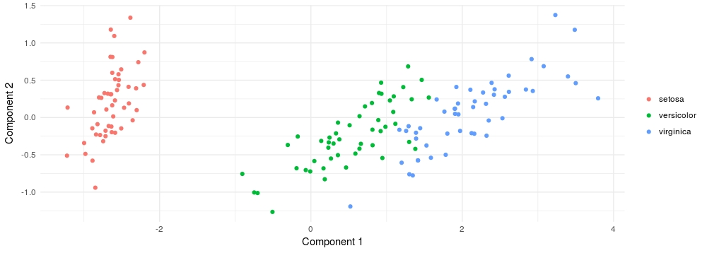

# Using Scikit-Learn from R

<br>

### Intro

This repo is all about using [Scikit-Learn](http://scikit-learn.org/stable/index.html) from R.

[Scikit-Learn](http://scikit-learn.org/stable/index.html) is a great set of tools that every data scientist should know. It is well implemented and has an incredible documentation. Thanks to the wonderful [reticulate](https://github.com/rstudio/reticulate) package by [RStudio](https://www.rstudio.com/), using [Scikit-Learn](http://scikit-learn.org/stable/index.html) from R is now pretty easy.

<br>

### Small example

Let's start with an example using the *iris* data set. Imagine we want to reduce the dimensionality of the data set using PCA:

```
library(reticulate)

iris_features <- as.matrix(iris[, -5])
iris_class <- as.vector(iris[, 5])

decomposition <- import("sklearn.decomposition")

pca <- decomposition$PCA(n_components = 2L) # we use 'L' to input an integer value
result <- pca$fit_transform(X = iris_features)

str(result)

```

```
num [1:150, 1:2] -2.68 -2.71 -2.89 -2.75 -2.73 ...
```

<br>

That looks great! Let's plot it:

```

library(ggplot2)

ggplot() + 
  geom_point(aes(x = result[,1], y = result[,2], color = iris_class)) +
  theme_minimal() +
  theme(legend.title=element_blank()) +
  labs(x = "Component 1", y = "Component 2")

```



<br>

Have you seen that? I have just used [Scikit-Learn](http://scikit-learn.org/stable/index.html) and [ggplot2](http://ggplot2.org/) in the same script!!! :scream:

And this is exactly why this is so cool. We are now able to use the best tools without the need of changing language or IDE (without the need of leaving RStudio!). Pretty comfortable :smile:

<br>

### Setting things up

So, the first thing you need to do is to install the [reticulate](https://github.com/rstudio/reticulate) package:

```
install.packages("reticulate")
```

Then, if you don't already have it, you need to install Scikit-Learn with all its dependencies. You can find how to do it [here](http://scikit-learn.org/stable/install.html).

Once you are done, try to execute the previous example from R to see if everything is working fine. If not, go to the [reticulate repo](https://github.com/rstudio/reticulate) and try to find out what is failing.

You can use any Python package with *reticulate*, and you can even use conda environments directly. See the *reticulate repo* for more instructions.

<br>

### Translating examples from Python

The Scikit-Learn documentation is great and full of examples. Let's take one of them and use it from R.

Let's continue using the *iris* data set to avoid distractions. Imagine we want to train a decision tree classifier on the data set. So, we use google to find the way to do it in Scikit-Learn and reach [this web page](http://scikit-learn.org/stable/modules/generated/sklearn.tree.DecisionTreeClassifier.html). It contains a very good code example:

```
>>> from sklearn.datasets import load_iris
>>> from sklearn.model_selection import cross_val_score
>>> from sklearn.tree import DecisionTreeClassifier
>>> clf = DecisionTreeClassifier(random_state=0)
>>> iris = load_iris()
>>> cross_val_score(clf, iris.data, iris.target, cv=10)

```

The example trains a decision train classifier using 10-fold cross validation. The equivalent code in R is:

```

iris_data <- as.matrix(iris[, -5])
iris_target <- as.vector(iris[, 5])

model_selection <- import("sklearn.model_selection")
tree <- import("sklearn.tree")

clf <- tree$DecisionTreeClassifier(random_state = 0L)
model <- model_selection$cross_val_score(clf, iris_data, iris_target, cv=10L)

```

Some important details:

- Observe that I have converted the target to a vector, not a matrix. That's because when we do cross validation in scikit-learn, the process requires an (N,) shape label instead of (N,1), i.e., we need a vector, not a matrix.

- In the import section of the code, we import **modules**, not functions. Once we have the module in a R variable (as an environment) we can use any function inside the module using the format `module$function`.

- Again, when introducing integer values, we need to specify the type in R using 'L', as shown in `random_state = 0L` or `cv=10L`. That's because when you define a numeric variable in R it is defined as a real value by default. 

<br>

And that's it! Play a bit with this and give me some feedback.

